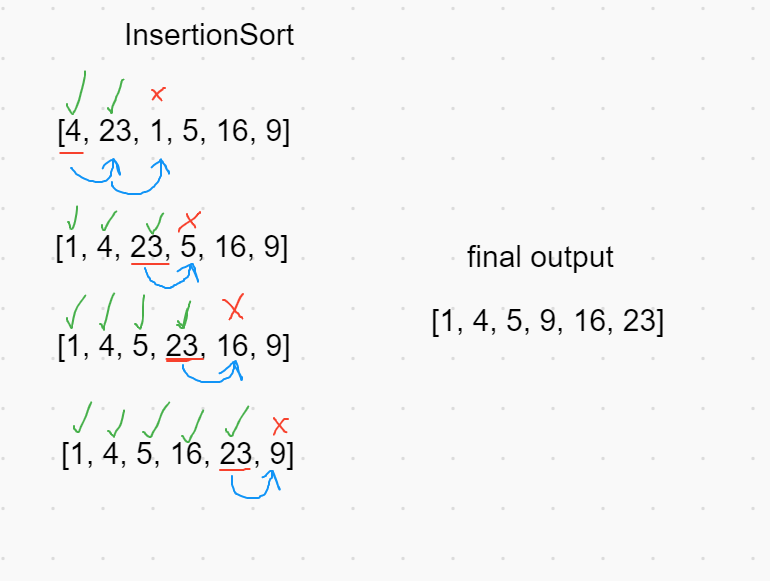

# Insert Sort Blog
The Insert sort method will take an array and sort the values as they are encountered from front to back. This means that every position before the value being checked has already been sorted. So as each value is checked, in order to place it into the already sorted section, a value larger than the value checked will move forward in position in order to make room. 

### Walkthrough

The first step of the insertion sort is to find the lowest value to place at the front of the array. We do this by iterating through the entire array, comparing the values. When that value is found, it is swapped in place with whatever value was at index 0.

Now that the first index is set, we continue with the array from the second index. In my example the second number is 8, which happened to belong in the 1st index position. However, we still need to compare 8 to the rest of the array. Once this is done we can move on to the next number.

Again, we iterate over the array to find the next lowest number that belongs in the 2nd index position. We iterate again and find that 15 is the next lowest number, so it swaps in place with 23.

The first four numbers are ordered in place, so we check the last two numbers values. We see that we have 42 and 23, they are swapped in place and our array is sorted!

We iterate using a for loop, and we swap the values in place using a temp variable. This works by finding the two values that will be swapped, i and j. i is assigned to be the temp variable, then i is replaced with j. The previous j is assigned to the temp, thus the swap is done!

### Efficiency and time

- The time efficiency is O(n^2)
    - This is a comparison operation. We have to check each number in the array until we hit the end.
    
- The time efficiency is O(1)
    - No additional space is being created, everything is sorted in place.
